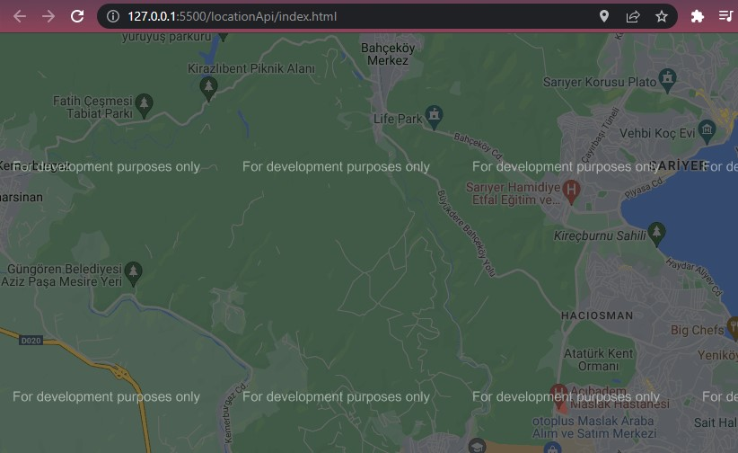
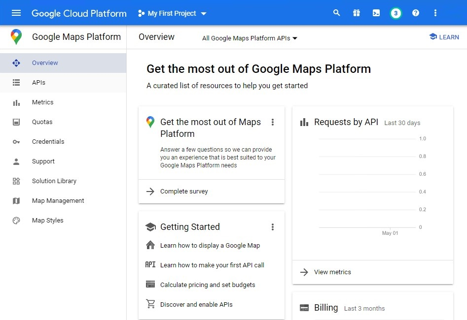
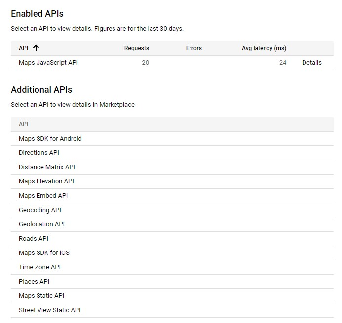
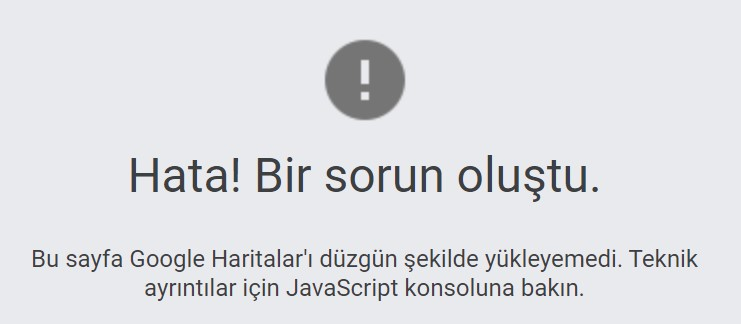

# Maps Location API with Google Maps Platform

## Description

In this project, we will be using the [Google Maps Platform](https://developers.google.com/maps/documentation/javascript/get-api-key) for getting Javascript Maps API to create a map that will show the user their current location.

## Getting started with Google Maps Platform

[Getting started with Google Maps Platform](https://developers.google.com/maps/get-started)

If you have never used the Google Cloud Console to create a billing account or a project, click the Get Started button that links to an interactive setup experience in the Cloud Console for new users.

## Step 1 Set up your project

In the Google Cloud Console, on the project selector page, click Create Project to begin creating a new Cloud project.

[Set up your project](https://console.cloud.google.com/projectselector2/home/dashboard)

- In the Google Cloud Console, on the project selector page, click Create Project to begin creating a new Cloud project.

## Step 2 Enable APIs

To use Google Maps Platform, you must enable the APIs or SDKs you plan to use with your project.

- See the Google Maps Platform APIs and SDKs that you can enable by going to the Maps API Library page in the Cloud Console

[Enable APIs](https://console.cloud.google.com/project/_/google/maps-apis/api-list)

Note that some integrations require you to enable multiple APIs/SDKs. If you are not sure which APIs or SDKs to enable, try using the API Picker, or consult the documentation for the API/SDK you want to use.

## Step 3 Create an API Key

This step only goes through the API Key creation process. If you use your API Key in production, we strongly recommend that you restrict your API key. You can find more information in the product-specific Using API Keys page.

The API key is a unique identifier that authenticates requests associated with your project for usage and billing purposes. You must have at least one API key associated with your project.

[Get Credentials](https://console.cloud.google.com/project/_/google/maps-apis/credentials)

- Go to the Google Maps Platform > Credentials page.

- On the Credentials page, click Create credentials > API key.
  The API key created dialog displays your newly created API key.
- The new API key is listed on the Credentials page under API keys.

## Error handling

If your API is not valid Google Chrome will not be able to use the API and gives the following error:

## Resources

- [Google Developers](https://developers.google.com/maps/get-started)

- [Google Maps API Javascript](https://youtu.be/zbFDQ16oRwY)
